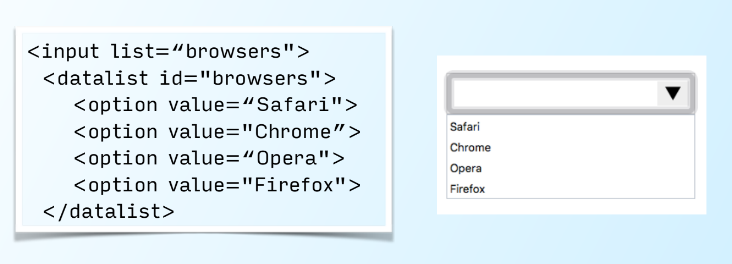
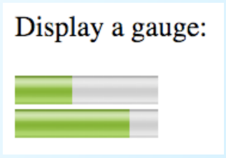
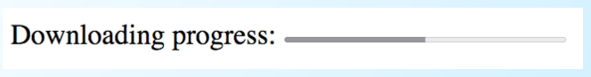
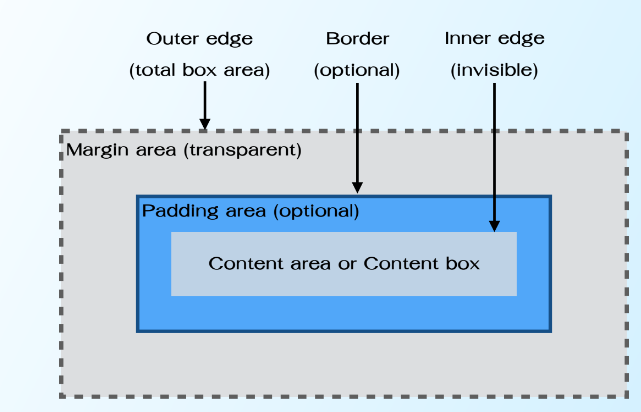

**Media Player API**

**Session History API**

**Offline Web Application API**
ไม่สาใช้งานได้โดยไม่มีอินเตอร์เน็ต
**Editing API**
สามารถแก้ไขได้
**Drag and Drop API** 
สามารถลากวางได้

**Canvas API**

**Web Storage API**

**Geolocation API**

**Web Workers API**

**Web Sockets API**

---
_Global Attributes_

>contenteditable : ระบุว่าผู้ใช้สามารถแก้ไของค์ประกอบได้

```html
<p contenteditable="true">This is an editable paragraph.</p>
```

>draggable : ระบุว่าองค์ประกอบนั้นสามารถลากได้

```html
<p draggable="true">This is a draggable paragraph.</p>


>hidden :ป้องกันองค์ประกอบและองค์ประกอบทายาทจากการแสดงผลในผู้ใช้ตัวแทน (เบราว์เซอร์)

```html
<p hidden>This paragraph should be hidden.</p>
```

>spellcheck:บ่งบอกองค์ประกอบที่จะมีตรวจสอบการสะกดและไวยากรณ์

```html
<p contenteditable="true" spellcheck="true">
This is an editable paragraph.
</p>
```

>Sections and outlines

```html
<header>, <nav>, <main>, <section>, <article>, <footer>
and <aside>
```
[Linls](http://www.siamhtml.com/sectioning-content-html5-%E0%B8%84%E0%B8%B7%E0%B8%AD%E0%B8%AD%E0%B8%B0%E0%B9%84%E0%B8%A3/)
>New semantic elements such as

```html
<figure>, <figurecaption>, <mark>, <progress>,
<meter>, <time>
```

>HTML5 Audio and Video
>figure: 

```html
<figure>
<video src="example.webm" controls></video>
<figcaption>Example</figcaption>
</figure>
```
>mark :เน้นเอกสาร

```html
<body>
<p>This is a <mark>paragraph</mark></p>
</body>
```

>Form Elements
**tel,search,search,email,date,time,number,range,color **

>comboboxes

```html
<input list=“browsers">
<datalist id="browsers">
<option value=“Safari">
<option value="Chrome”>
<option value=“Opera">
<option value="Firefox">
</datalist>
```


>meter

```html
<p>Display a gauge:</p>
<meter value="4" min="0" max="10">4 out of 10</meter><br>
<meter value="0.8">80%</meter>
```


>progress element

```html
<section>
Downloading progress:
<progress value="50" max="100"></progress>
</section>
```

---
**CSS box model**



>The sizing of content box
ใช้คุณสมบัติ "ความกว้าง" และ "ความสูง" ซึ่ง ได้แก่
คำนวณโดยอัตโนมัติโดยเบราว์เซอร์เริ่มต้น
ค่าเป็นอัตโนมัติ

```css
p {
box-sizing: content-box;
width: 100%;
}
```

>The sizing of border box

```css
p {
box-sizing: border-box;
width: 100%;
}
```

>Flex Containers: ประกาศโดยตั้งค่าการแสดงผล
คุณสมบัติขององค์ประกอบเพื่อ flexbox

>>For a block level flexbox

```css
selector {
display: flex;
...
...
}
```
>>For an inline level flexbox

```css
display: inline-flex;
...
...
```

>flex-direction ในการกำหนดทิศทางการไหลของ flex items ให้เป็นแบบ column หรือในแนวตั้ง

>>Default direction is row

>>flex-direction: column;

>>flex-direction: column;

>>flex-direction: initial;

```css
flex-direction: column-reverse;
flex-direction: initial;
flex-direction: inherit;
```

>flex-wrap
```css
flex-wrap: nowrap;
flex-wrap: wrap;
flex-wrap: wrap-reverse;
```